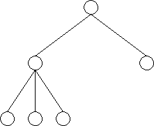
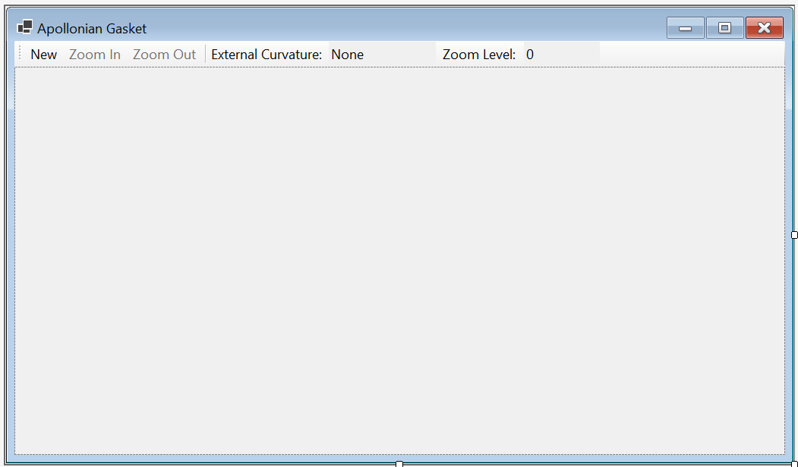
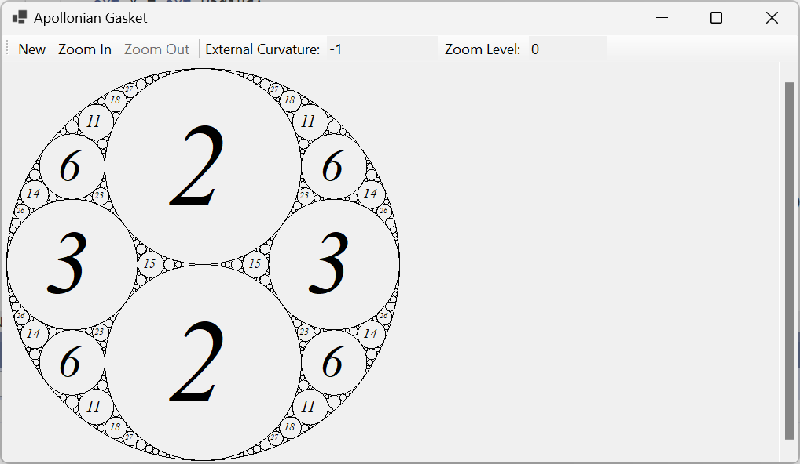
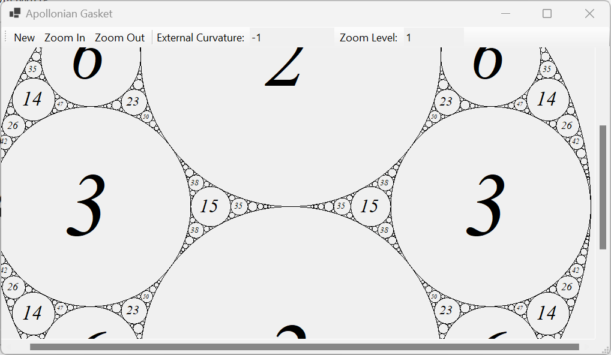
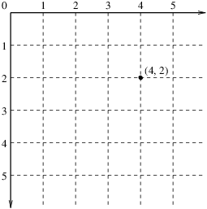
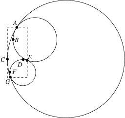
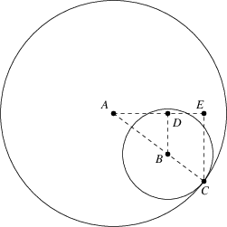
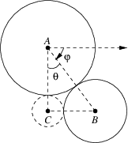
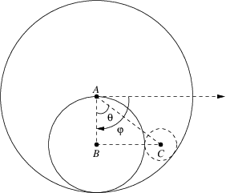
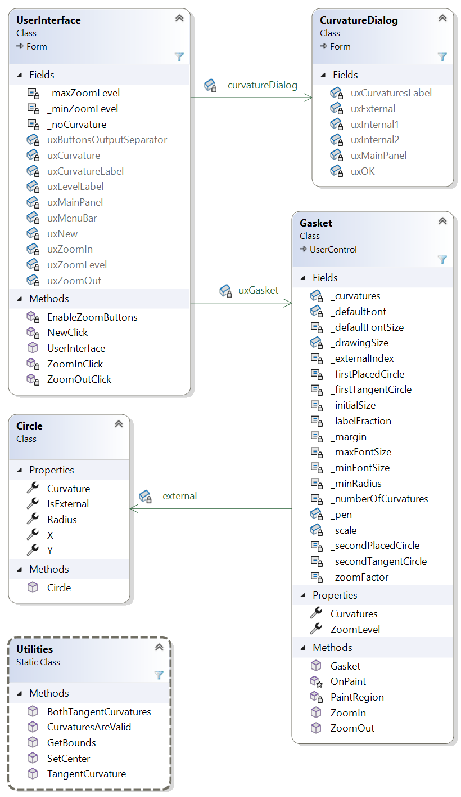

# Homework Assignment 3: Apollonian Gasket

For this assignment, you will write a complete program to display Apollonian gaskets.

## 0. Contents

[TOC]

## 1. Apollonian Gaskets

A mathematician wants a tool that supports the examination of Apollonian gaskets such as the following:


An Apollonian gasket is a fractal pattern constructed as follows:

1. Draw three circles, each of which is tangent to the other two (i.e., intersects at a single point), at three distinct points. One of these circles should contain the other two in its interior. For example:
   
   We can think of this step as forming the root of a tree *t*.
2. There are now two regions bounded by these three circles. We can think of these regions as children of the root of *t*. For each node in *t* other than the root, we add a circle tangent to the three circles bounding the region. Each circle added in this way forms three new regions, which form three children of the region containing the circle that was added. For example, adding a circle to the region on the right yields the following:
   
   The tree *t* at this point looks as follows:
   

Note that because each time a circle is drawn in Step 2, three new nodes are added to *t*, this process is infinite, and each node in *t* other than the root has exactly three children. However, we can make this process finite if we stop drawing circles when they become too small to see.

The numbers shown it the first figure above give the *curvature* of each circle. Suppose a circle has radius *r*. Then its curvature is defined to be 1/*r*. We modify this definition slightly for the external circle - its curvature is defined to be -1/*r*. In the first figure, the curvature of the external circle is -1. In either case, if we know the curvature of a circle, we can easily compute its radius.

The curvatures of circles in an Apollonian gasket are related by Descartes's Theorem, which says that if four circles having curvatures *a*, *b*, *c*, and *d* are such that each circle is tangent to each of the other three, then <a name="eqn1"></a>
$$
(a + b + c + d)^2 = 2(a^2 + b^2 + c^2 + d^2). \tag{1}
$$
For example, the first four circles drawn above have curvatures -1, 2, 2, 3, and
$$
(-1 + 2 + 2 + 3)^2 = 36 = 2((-1)^2 + 2^2 + 2^2 + 3^2).
$$
By rearranging the terms of [(1)](#eqn1), we obtain a quadratic in *d*:
$$
\begin{alignat}{2}
(a + b + c + d)^2 &= 2(a^2 + b^2 + c^2 + d^2) \\
a^2 + b^2 + c^2 + d^2 + 2ab + 2ac + 2ad + 2bc + 2bd + 2cd &= 2(a^2 + b^2 + c^2 + d^2) \\
2(ab + ac + ad + bc + bd + cd) &= a^2 + b^2 + c^2 + d^2 \\
d^2 - 2(a + b + c)d + a^2 + b^2 + c^2 - 2(ab + ac + bc) &= 0.
\end{alignat}
$$
We can now apply the quadratic formula to solve for *d* int terms of *a*, *b*, and *c*:<a name="eqn2"></a>
$$
\begin{alignat}{2}
d &= \frac{2(a + b + c) \pm \sqrt{4(a + b + c)^2 - 4(a^2 + b^2 + c^2 - 2(ab + ac + bc))}}{2} \\
&= a + b + c \pm \sqrt{4(ab + ac + bc)} \\
&= a + b + c \pm 2\sqrt{ab + ac + bc}. \tag{2}
\end{alignat}
$$
Notice that there are two solutions for *d*. This is because given three mutually tangent circles, there are two ways of adding a fourth tangent to each of the other three - see the example in Step 2 above. However, once we have added each of the two circles tangent to the three initial circles, each time we add a subsequent circle, one of the two tangent circles will already have been added. We therefore need a formula for computing the curvature of one circle tangent to three mutually tangent circles, given that we know the curvature of the other circle tangent to these three circles. We can obtain this formula by adding together the two solutions in [(2)](#eqn2):<a name="eqn3"></a>
$$
\begin{alignat}{2}
d_1 + d_2 &= 2(a + b + c) \\
d_2 &= 2(a + b + c) - d_1 \tag{3}
\end{alignat}
$$
Note that if *a*, *b*, *c*, and *d*<sub>1</sub> are all integers, then *d*<sub>2</sub> will also be an integer. It follows that if the first four curvatures in the construction are all integers, then all subsequent curvatures will also be integers. We are interested in Apollonian gaskets in which all curvatures are integers. We will discuss how to find the location to draw each circle in [5.4. Finding the Center of a Circle](#5.4. Finding the Center of a Circle).

## 2. User Requirements

The user needs a tool to draw an Apollonian gasket given the curvature of the external circle and the integer curvatures of the first two circles tangent to it and to each other, provided the curvatures of all circles in the gasket are integers. It does *not* need to be able to display gaskets in which some or all of the circles have non-integer curvature. The drawing should not include circles too small to appear as circles, but it should include all other circles. Centered within each circle other than the external circle, the curvature of that circle should be displayed, provided the circle is large enough to display the curvature legibly. The curvature of the external circle also must be displayed within the GUI.

The tool should allow the user to zoom to a maximum magnification factor of 64. Each zoom level should double magnification factor of the previous level. Zooming to a higher magnification should reveal more detail; i.e., circles that were too small to be shown at lower magnifications should become visible when they become large enough, and text that would not fit legibly at lower magnifications should be included when the containing circles become large enough. The current zoom level should be indicated within the GUI. When the drawing becomes too large to fit into the GUI, it should be possible to pan the drawing to reveal different parts of it. 

## 3. Starting the Assignment

Create a GitHub repository using the URL provided on the Canvas assignment page, and clone it to your local machine. This repository contains a new Windows Forms App and a unit test project. You will need to provide all of the code, including the user interface.

## 4. User Interface

The [demo video]() demonstrates the desired look and feel of the program. Here, we first describe the design of the two forms that you will need to create through the Design window. Then we will describe the intended behavior of the program.

**Important:** Do the GUI design before writing any code. One step of the GUI design will require you to compile your program, and if you have syntax errors, you won't be able to do this. Furthermore, some errors in your code might prevent the Design window from displaying.

### 4.1. The Main GUI

The GUI you should design within the Design window should resemble the following:



At the top is a **ToolStrip**. Click on the icon within the **ToolStrip** to add a button. You will need to change this button's **DisplayStyle** property to **Text**. Then you can change its **Text** property to the string shown in the above figure. Create three buttons in this way, and disable the "Zoom In" and "Zoom Out" buttons.

To add the separator, click on the drop-down on the right side of the icon you used to add the buttons, and select "Separator". "External Curvature" is a label - through the same drop-down, select "Label", and set its **Text** property appropriately. Following this label is a **TextBox**. Select "TextBox" from the dropdown, and set its **Text** property as shown above. Make this **TextBox** read-only via its **ReadOnly** property. Then create another **Label** and read-only **TextBox** to complete the controls on the **ToolStrip**.

Below the **ToolStrip** is a **FlowLayoutPanel**. This panel will hold the drawing of the Apollonian gasket. To cause it to fill the remainder of the form, set its **Dock** property to **Fill** by selecting the large button in the center of the dropdown for this property. To support panning the drawing, the panel will need scrollbars whenever the drawing becomes larger than the panel. To get this behavior, set its **AutoScroll** property to **True**.

The last component you will need for this form is a control to display the drawing. You will need to build this control. Right-click on the project name (in boldface) in the Solution Explorer and select "Add -> User Control (Windows Forms)...". In the resulting dialog, enter "Gasket.cs" (without the quotation marks) into the "Name:" **TextBox**, and click the "Add" button. This will open a new Design window containing a gray rectangle, which represents the control. Set the following properties for this control:

- **DoubleBuffered**: **True**. This facilitates smoother scrolling by making all updates to a second off-screen copy of the display.
- **Enabled**: **False**. The user doesn't need to interact with this control, and if it's enabled, it interferes with scrolling.

The remainder of the implementation of this control will be done by coding, as outlined in [8.3. The Gasket Class](#8.3. The Gasket Class).

At this point, you will need to run your program so that the code is compiled. After stopping your program's execution, **Gasket** should be listed at the top of the Toolbox (you'll need to scroll to the very top). You can now add a **Gasket** to the **FlowLayoutPanel** in the main GUI.

### 4.2. The Curvature Dialog

You will also need a dialog for obtaining three curvatures from the user. Add a form to your project by right-clicking on the project in the Solution Explorer and selecting "Form (Windows Forms)...". In the resulting dialog, name the file **CurvatureDialog.cs**, and click the "Add" button.

The dialog you are to build should resemble the following in the Design window:


The controls are contained within a **FlowLayoutPanel**. To cause the panel to arrange the controls from top to bottom, set the panel's **FlowDirection** property to **TopDown**, and set its **WrapContents** property to **False**.

You will then need to add a **Label**, three **NumericUpDown**s, and a **Button** to the **FlowLayoutPanel**. The first **NumericUpDown** should have a **Minimum** of -1000, and **Maximum** of -1, and a **Value** of -1. The other two should each have a **Minimum** of 2, a **Maximum** of 1000, and a **Value** of 2. To cause the "OK" button to close the dialog and return **DialogResult.OK**, set its **DialogResult** property to **OK**.

Once all controls have been added to the panel, set its **AutoSize** property to **True** and its **AutoSizeMode** property to **GrowAndShrink**. This will cause the panel to resize itself so that it is just big enough to contain the controls. Then set these same properties for the form in the same way. You won't see any change to the size of the form in the Design window, but when the program displays it, its size will be just big enough to contain the **FlowLayoutPanel**. Finally, to cause the `Enter` key to close the dialog as if the "OK" button had been clicked, set the form's **AcceptButton** property to the name of the "OK" button.

### 4.3. Behavior of the GUI

When running the program, the initial GUI should resemble the contents of the Design window for the main GUI. Only the "New" button should be enabled initially. Clicking it should open the curvature dialog, which should resemble the following:


The first time this dialog is displayed, the values in the **NumericUpDown**s should be those shown above. When it is displayed subsequently, these values should be the values contained when the dialog was last closed, no matter how it was closed.

Closing this dialog by clicking the "X" in the upper-right corner should cause the main GUI to remain unchanged. Closing the dialog by either clicking the "OK" button or pressing the `Enter` key should cause the program to determine whether the curvatures selected via the dialog result in integer curvatures for all circles in the resulting gasket. If not, a **MessageBox** displaying the message, "The given curvatures are invalid." should be displayed, and the main GUI should revert to its initial state. Specifically, any drawing should be removed, any scrollbars should disappear, the "Zoom In" and "Zoom Out" buttons should be disabled, the textbox displaying the external curvature should be set to "None", and the textbox displaying the zoom level should be set to 0. 

If the curvatures selected by the user result in integer curvatures for all circles in the resulting gasket, this gasket should be displayed in the window as outlined in [2. User Requirements](#2. User Requirements) and described in more detail below. Furthermore, the "Zoom In" button should be enabled, the curvature of the external circle should be shown in the textbox displaying the external curvature, and "0" should be shown in the textbox displaying the zoom level. For example, if the user had selected curvatures of  -1, 2, and 2, the GUI should resemble the following:



The gasket should initially be shown with its top edge at the top of the window (just below the **ToolStrip**) and its left edge at the left of the window. Its size should be 500 pixels by 500 pixels. The curvature shown within each internal circle should be displayed using an italic serif font, scaled so that the with of the drawn text is 70% of the diameter of the circle, up to a maximum font size of 150 pixels. If scaling in this way results in a font size of less than 8 pixels, the curvature should not be displayed. Circles with a radius of less than 2 pixels should not be drawn.

If the entire gasket will not fit within the window, either horizontally or vertically, appropriate scrollbars should appear. A horizontal scrollbar should appear at the bottom of the window when necessary, and it should allow the user to pan the gasket from a minimum position in which the left edge of the gasket is at the left edge of the window to a maximum position in which the right edge of the gasket is at the right edge of the window. A vertical scrollbar should appear on the right edge of the window when necessary, and it should allow the user to pan the gasket from a minimum position in which the top of the gasket is at the top of the window to a maximum position in which the bottom of the gasket is at the bottom of the window. Resizing the window should allow the scrollbars to appear/disappear as needed.

Clicking the "Zoom In" button should cause the gasket to double in size. If possible, the point at the center of the display should remain at the center after zooming. If this is impossible due to the constraints on scrolling described in the above paragraph, the point previously at the center should be as close as possible to the center of the display after zooming. Other than the size of the drawing, the above rules for drawing the gasket should still apply; hence, more detail will be shown. The value in the textbox showing the zoom level should increase by 1. If this value is becomes 6, the "Zoom In" button should be disabled. In any case, the "Zoom Out" button should be enabled. For example, clicking "Zoom In" on the GUI shown above should result in the following:



Clicking the "Zoom Out" button should cause the gasket's size to be reduced by half; hence, it should return the drawing to the same as an earlier drawing. If possible, the point at the center of the display should remain at the center after zooming out. If this is impossible, the point previously at the center should be as close as possible to the center of the display after zooming out. The value in the textbox showing the zoom level should decrease by 1. If this value becomes 0, the "Zoom Out" button should be disabled. In any case, the "Zoom In" button should be enabled.

## 5. Drawing an Apollonian Gasket

In this section, we will present the algorithm for drawing an Apollonian gasket. This algorithm will be used when any part of the **Gasket** control needs to be redrawn (for example, due to scrolling or moving another window that was partially obscuring it). We will base our algorithm on the tree described in [1. Apollonian Gaskets](#1. Apollonian Gaskets). Our algorithm will not actually build this tree; i.e., we will not represent this tree explicitly in code. Instead, we will design our algorithm as if it were traversing a portion of this tree, which will only exist in our minds. Note that because the tree is infinite, we can only traverse the portion representing sufficiently-large circles. Also note that the root of the tree has two children, whereas every other node in the entire infinite tree has three children. We will therefore consider the root as a special case. 

We will first discuss the coordinate systems used by the algorithm. Then we will give an overview of the recursive algorithm. After that, we will discuss several aspects of the recursive algorithm in more detail. Finally, we will present the algorithm used at the root of the tree.

### 5.1. Coordinate Systems

The Apollonian gaskets will need to be drawn using a *pixel* coordinate system. Within this coordinate system, the external circle at zoom level 0 will have a radius of 250, and when the zoom level changes, the radii change. This coordinate system is organized so that (0, 0) is at the upper-left corner of the **Gasket** control. The *x*-coordinate increases going to the right, and the *y*-coordinate increases going downward:



The curvatures given by the user are expressed at a different scale. Specifically, all circles have a radius no more than 1, as -1 is the smallest curvature allowed for an external circle. To keep the curvatures integers, it makes sense to do most of the calculations within this *internal* coordinate system, scaling to the pixel coordinate system by multiplying all values by an appropriate scale factor only when we are ready to draw. Thus, within the internal coordinate system, the radii of the circles will remain unchanged when the zoom level changes. 

To avoid confusion, we will organize the internal coordinate system like the pixel coordinate system, with the *x*-coordinate increasing going to the right and the *y*-coordinate increasing going downward. We set the center of the external circle to be (*r*, *r*), where *r* is its radius; hence, scaling to pixel coordinates will place this circle in the upper-left corner.

### 5.2. Overview of the Recursive Algorithm

In this section, we give an overview of the recursive algorithm to traverse a portion of the tree, excluding the root.

This algorithm needs the following parameters:

- The curvature of the next circle to be drawn.
- Descriptions of the three circles, *c*<sub>1</sub>, *c*<sub>2</sub>, and *c*<sub>3</sub>, to which the next circle must be tangent. We will adopt the following conventions for these three parameters:
  - If one of them is the external circle, it is *c*<sub>1</sub>.
  - They are given in an order such that their tangent points with the next circle to be drawn are listed clockwise around that circle. For example, in the last figure of [4.3. Behavior of the GUI](#4.3. Behavior of the GUI), if the circle with curvature 35 is the next to be drawn, the external circle is *c*<sub>1</sub>, the circle with curvature 14 is *c*<sub>2</sub>, and the circle with curvature 6 is *c*<sub>3</sub>.
- The object on which the gasket is to be drawn. We will not refer explicitly to this object in the description of the algorithm, but various information, such as the region that needs to be redrawn, will be obtained from this object.

To ensure that the algorithm terminates, we need at least one base case. The most obvious one is if the radius corresponding to the given curvature, when scaled to pixel coordinates, is too small to draw. In this case, there is nothing to do. A second base case is that the region bounded by the three given circles doesn't intersect with the region that needs to be drawn. In this case, we can optimize performance by doing nothing as well. However, the region bounded by three circles is awkward to work with. For this reason, we will approximate this region by finding a *bounding rectangle* that includes all of it. This rectangle will have two sides parallel to the *x*-axis and two sides parallel to the *y*-axis.

The algorithm then is as follows:

1. Obtain the radius corresponding to the given curvature.
2. Find the bounding rectangle, in pixel coordinates, for the region bounded by the given circles.
3. If the radius, scaled to pixel coordinates, is at least the minimum radius for drawing and the bounding rectangle intersects with the area that needs to be redrawn:<ol type="a"><li>Determine the center of the circle to be drawn. Call this circle *c*.</li><li>Draw *c*, scaled to pixel coordinates.</li><li>Recursively draw the region bounded by *c*, *c*<sub>2</sub>, and *c*<sub>3</sub>. Compute the curvature of the next circle using [(3)](#eqn3), where *d*<sub>1</sub> is the curvature of *c*<sub>1</sub>.</li><li>Recursively draw the region bounded by *c*<sub>1</sub>, *c*, and *c*<sub>3</sub>. Compute the curvature of the next circle using [(3)](#eqn3), where *d*<sub>1</sub> is the curvature of *c*<sub>2</sub>.</li><li>Recursively draw the region bounded by *c*<sub>1</sub>, *c*<sub>2</sub>, and *c*. Compute the curvature of the next circle using [(3)](#eqn3), where *d*<sub>1</sub> is the curvature of *c*<sub>3</sub>.</ol>

Note that steps 3.c. through 3.e. above handle the three children of the current tree node - the three regions formed by the newly-drawn circle *c* and two of the circles tangent to it. These three circles are listed to conform to conventions set above for these parameters (i.e., they are listed clockwise, and if one of them is the external circle, it is listed first).

Two aspects of the above algorithm need more discussion: finding the bounding rectangle in Step 2 and determining the center of the circle in step 3.a. The next two sections will give more details for these computations.

### 5.3. Finding a Bounding Rectangle

In this section, we will consider how to find a bounding rectangle for a region bounded by three circles. The basic idea is to find the minimum and maximum *x*- and *y*-coordinates of any point in the region. Because we are looking for minimum and maximum values, we can restrict our attention to points on the border of the region. We can further restrict our attention to *inflection points* of the border - points at which either the *x*- or *y*-coordinate changes from increasing to decreasing or vice versa. Furthermore, we only need to consider those inflection points at which, if we were to continue moving beyond the local maximum or minimum, we would move to the exterior of the region.

Consider, for example, the region bounded by the rectangle in the following figure:



There are seven inflection points, indicated by the labels *A*, *B*, . . ., *G*, on the border of this region. *A*, *E*, and *G* are points at which two of the circles are tangent. We will always need to consider such points. *B* is a point at which the circle on which it lies reaches its minimum *x*-value. However, if we continue decreasing the *x*-coordinate, we reach the interior of the region we are bounding; hence, there are points in this region with smaller *x*-values. Consequently, we don't need to consider this point. We see similar behavior with points *D* and *F* - in fact, this always happens for points on internal circles. However, consider point *C*, which is on the external circle. This point is where the external circle reaches its minimum *x*-value. If we continue decreasing *x*, we leave the region we are bounding; hence, we need to consider this point. In fact, the points *A*, *C*, *E*, and *G* define the bounding rectangle:

- *A* has the minimum *y*-value.
- *C* has the minimum *x*-value.
- *E* has the maximum *x*-value.
- *G* has the maximum *y*-value.

Therefore, to find the bounding rectangle, we need to find the three points at which two of the three circles are tangent. Furthermore, if one of the three circles is the external circle, we need to find any inflection points on this circle, where it borders the region. We will consider how to find each of these sets of points in the following two sections.

#### 5.3.1. Finding tangent points

We can easily find the point at which two circles are tangent as long as we know the centers and radii of these circles. We'll first consider the case in which both circles are internal, as shown in the following figure:


In the above figure, the line segment *AE* is parallel to the *x*-axis, and the line segments *CD* and *BE* are parallel to the *y*-axis. The tangent point *C* is on the line connecting the two centers, *A* and *B*. Furthermore, the two triangles, *ACD* and *ABE* are similar triangles; i.e., the ratio of the lengths of *AB* to *AC* is the same as the ratio of lengths of *AE* to *AD*, which in turn is the same as the ratio of the lengths of *BE* to *CD*. Let *A* = (*x*<sub>*A*</sub>, *y*<sub>*A*</sub>) and *B* = (*x*<sub>*B*</sub>, *y*<sub>*B*</sub>), both of which are known. We need to find *C* = (*x*<sub>*C*</sub>, *y*<sub>*C*</sub>). We also know that the lengths of *AC* and *BC* are the radii of the two circles, which we will denote *r<sub>A</sub>* and *r<sub>B</sub>*, respectively. Assume for now that *x<sub>B</sub>* > *x<sub>A</sub>* and that *y<sub>B</sub>* > *y<sub>A</sub>*. Using the fact that the triangles are similar, we have: <a name="eqn4"></a>
$$
\begin{alignat}{2}
\frac{r_A + r_B}{r_A} &= \frac{x_B - x_A}{x_C - x_A} \\
x_C - x_A &= \frac{r_A(x_B - x_A)}{r_A + r_B} \\
x_C &= x_A + \frac{r_A(x_B - x_A)}{r_A + r_B}, \tag{4}
\end{alignat}
$$
and <a name="eqn5"></a>
$$
\begin{alignat}{2}
\frac{r_A + r_B}{r_A} &= \frac{y_B - y_A}{y_C - y_A} \\
y_C - y_A &= \frac{r_A(y_B - y_A)}{r_A + r_B} \\
y_C &= y_A + \frac{r_A(y_B - y_A)}{r_A + r_B}. \tag{5}
\end{alignat}
$$
It is not hard to show that (4) and (5) also hold when *x<sub>B</sub>* &le; *x<sub>A</sub>* or *y<sub>B</sub>* &le; *y<sub>A</sub>*.

Now suppose one of the circles is the external circle:



In this case, the length of line segment *AC* is *r<sub>A</sub>*, and the length of line segment *AB* is *r<sub>A</sub>* - *r<sub>B</sub>*. Proceeding as above, we can show that <a name="eqn6"></a>
$$
C = \left(x_A + \frac{r_A(x_B - x_A)}{r_A - r_B}, y_A + \frac{r_A(y_B - y_A)}{r_A - r_B}\right).\tag{6}
$$

#### 5.3.2. Finding other inflection points

As we pointed out above, we only need to look for other inflection points if the external circle bounds the region we want to draw. There are four such inflection points on this circle. We can dispense with one of them if we add the first internal circle so that it is tangent to the external circle at this point. Therefore, we will assume the following:

- This circle has radius *r*.
- Its center is (*r*, *r*). 
- The first internal circle is tangent to this circle at (*r*, 0), where the *y*-coordinate reaches its minimum on the external circle.

Given these assumptions, we can ignore the point (*r*, 0) because if it is on the border of the region, it will be a tangent point, and hence taken care of by the techniques above. Given that we know how to find the three tangent points for the region, and that the parameters to the recursive algorithm are such that the circles bounding the region are listed in clockwise order (see [5.2. Overview of the Recursive Algorithm](#5.2. Overview of the Recursive Algorithm)), we can assume that we have two tangent points, *A* and *B*, on the external circle, such that *A* precedes *B* when we follow the border of the region along the external circle in a clockwise direction; for example:


Because we move clockwise from *A* to *B*, we are interested in the large region within the external circle in the above figure. Note that the external circle is divided into quadrants, which will aid in the discussion that follows. We will assume that each quadrant includes its boundaries; e.g., the point (2*r*, *r*) is in both the upper-right and the lower-right quadrants.

There are three points we need to consider:

- If *A* is in the upper-right quadrant and *B* is in one of the other three quadrants, (2*r*, *r*) is an inflection point at which the *x*-value is maximized.
- If *A* is in one of the two right quadrants and *B* is in one of the two left quadrants, (*r*, 2*r*) is an inflection point at which the *y*-value is maximized.
- If *A* is in the upper-right quadrant or either of the two left quadrants and *B* is in the upper-left quadrant, then (0, *r*) is an inflection point at which the *x*-value is minimized.

Thus, in the above figure, all three of the points (2*r*, *r*), (*r*, 2*r*), and (0, *r*) are inflection points, although as it turns out, the last of these points will have been detected when tangent points are identified. There is no harm in identifying an inflection point twice.

### 5.4. Finding the Center of a Circle

In this section, we will consider how to find the center of a circle that we wish to draw. We will assume that we know the curvature, and hence the radius, of the circle we wish to draw, as well as the curvatures, radii, and centers of two of the tangent circles. It turns out that we don't need any information on the third circle; hence, we can use this technique to find the center of the second internal circle, when only two circles have been drawn. We first consider the case in which the three tangent circles are all internal, as shown in the following figure:



Note that the circle to be drawn (centered at *C*) is also tangent to a third circle to the lower-left, but this circle is not shown in the figure. If we traverse the circle to be drawn, starting at its tangent point with the circle centered at *A* and moving clockwise, we encounter the tangent point with the circle centered at *B* before we encounter the tangent point with the circle not shown. This arrangement is important to ensure that the circle is not drawn to the right of the circles centered at *A* and *B*. 

The half-line going to the right from *A* is parallel to the *x*-axis. Because we know the radii of all three circles, we can compute the length of each side of the triangle *ABC* by adding together the radii of two circles whose centers it connects. Let *r<sub>A</sub>*, *r<sub>B</sub>*, and *r<sub>C</sub>* be the radii of the circles centered at *A*, *B*, and *C*, respectively. First, we can compute the angle *&theta;* using the [Law of Cosines](https://www.mathsisfun.com/algebra/trig-cosine-law.html): <a name="eqn7"></a>
$$
\theta = \cos^{-1}\left(\frac{(r_A + r_B)^2 + (r_A + r_C)^2 - (r_B + r_C)^2}{2(r_A + r_B)(r_A + r_C)}\right).\tag{7}
$$
Note that the cos<sup>-1</sup> always gives a nonnegative angle no more than &pi; [radians](https://www.mathsisfun.com/geometry/radians.html) (or 180 degrees); hence, there is no direction shown on this angle in the above figure.

Next, we can compute the angle *&phi;*, using basic trigonometry. Let *A* = (*x<sub>A</sub>*, *y<sub>A</sub>*) and *B* = (*x<sub>B</sub>*, *y<sub>B</sub>*). Then <a name="eqn8"></a>
$$
\varphi = \mathop{\text{atan2}}(y_B - y_A, x_B - x_A),\tag{8}
$$
where [atan2](https://en.wikipedia.org/wiki/Atan2) is the 2-argument arctangent. Note that atan2 returns an angle greater than -&pi; radians and at most &pi; radians; hence, it is important to note that this angle is measured clockwise, as shown in the above figure. Note because &phi; and &phi; + 2&pi; represent the same angle, a negative value for &phi; indicates that the angle is greater than a horizontal line.

We can now compute *C* using basic trigonometry: <a name="eqn9"></a>
$$
C = ((r_A + r_C)\cos(\varphi + \theta), (r_A + r_C)\sin(\varphi + \theta))\tag{9}
$$
Now let's suppose one of the two tangent circles is the external circle:



Again note that if we traverse the circle to be drawn clockwise, starting with its tangent point with the circle centered at *A*, we encounter the tangent point with the circle centered at *B* before we reach the third tangent point (not shown) above the circle we are drawing. 

The first difference to observe from the case with two internal circles is that the lengths of line segments *AB* and *AC* are now *r<sub>A</sub>* - *r<sub>B</sub>* and *r<sub>A</sub>* - *r<sub>C</sub>*, respectively. Thus, *&theta;* is given by: <a name="eqn10"></a>
$$
\theta = \cos^{-1}\left(\frac{(r_A - r_B)^2 + (r_A - r_C)^2 - (r_B + r_C)^2}{2(r_A - r_B)(r_A - r_C)}\right).\tag{10}
$$
*&phi;* can be computed as in [(8)](#eqn8), but we now need to subtract *&theta;* from *&phi;*; hence, *C* is given by: <a name="eqn11"></a>
$$
C = ((r_A - r_C)\cos(\varphi - \theta), (r_A - r_C)\sin(\varphi - \theta)).\tag{11}
$$

### 5.5. The Algorithm for the Root of the Tree

The algorithm given in [5.2. Overview of the Recursive Algorithm](#5.2. Overview of the Recursive Algorithm) handles all nodes of the the tree described in [1. Apollonian Gaskets](#1. Apollonian Gaskets), with the exception of the root node. Here, we describe the algorithm for this node. It is responsible for drawing the first three circles. We will assume that we have the curvatures (and hence the radii) of the first five circles, and that the curvature of the fourth circle is larger than the curvature of the fifth circle. 

The algorithm proceeds as follows:

1. Draw the external circle with a center of (*r*<sub>1</sub>, *r*<sub>1</sub>), where *r*<sub>1</sub> is the radius of this circle. This will place the circle at the upper-left corner.
2. Draw the next circle with a center of (*r*<sub>1</sub>, *r*<sub>2</sub>), where *r*<sub>2</sub> is the radius of this circle. This will place the circle so that it is tangent to the external circle at (*r*<sub>1</sub>, 0).
3. Draw the next circle with a center determined as described in [5.4. Finding the Center of a Circle](#5.4. Finding the Center of a Circle) with *A* being the center of the external circle and *B* being the center of the circle drawn in Step 2. This will place the circle so that it is tangent to both circles drawn above, below and to the left of the second circle.
4. Using the recursive algorithm (see [5.2. Overview of the Recursive Algorithm](#5.2. Overview of the Recursive Algorithm)), fill in the region bounded by the external circle, the circle drawn in Step 3, and the circle drawn in Step 2, passed in this order. This region will be the one to the right of the two internal circles. Use the curvature of the fourth circle as the first parameter.
5. Using the recursive algorithm (see [5.2. Overview of the Recursive Algorithm](#5.2. Overview of the Recursive Algorithm)), fill in the region bounded by the external circle, the circle drawn in Step 2, and the circle drawn in Step 3, passed in this order. This region will be the one to the left of the first two internal circles. Use the curvature of the fifth circle as the first parameter.

## 6. The Math Class

The **Math** class contains several **static** methods that you may find useful in implementing the above algorithms:

- [**Math.Abs**](https://learn.microsoft.com/en-us/dotnet/api/system.math.abs?view=net-6.0#system-math-abs(system-double)): returns a **double** giving the absolute value of the given **double**. There is also an [overload](https://learn.microsoft.com/en-us/dotnet/api/system.math.abs?view=net-6.0#system-math-abs(system-int32)) that takes an **int** and returns an **int**.
- [**Math.Acos**](https://learn.microsoft.com/en-us/dotnet/api/system.math.acos?view=net-6.0#system-math-acos(system-double)): given a **double** *x*, -1 &le; *x* &le; 1, returns a **double** giving cos<sup>-1</sup> *x* in [radians](https://www.mathsisfun.com/geometry/radians.html) .
- [**Math.Atan2**](https://learn.microsoft.com/en-us/dotnet/api/system.math.atan2?view=net-6.0): given two **double**s, returns the result of the [atan2](https://en.wikipedia.org/wiki/Atan2) function in radians as a **double**.
- [**Math.Cos**](https://learn.microsoft.com/en-us/dotnet/api/system.math.cos?view=net-6.0): given an angle *&theta;*in radians (a **double**), returns cos &theta; as a **double**.
- [**Math.Max**](https://learn.microsoft.com/en-us/dotnet/api/system.math.max?view=net-6.0#system-math-max(system-double-system-double)): given two **double**s, returns the maximum of the two as a **double**.
- [**Math.Min**](https://learn.microsoft.com/en-us/dotnet/api/system.math.min?view=net-6.0#system-math-min(system-double-system-double)): given two **double**s, returns the minimum of the two as a **double**. There is also an [overload](https://learn.microsoft.com/en-us/dotnet/api/system.math.min?view=net-6.0#system-math-min(system-single-system-single)) that takes two **float**s and **float**.
- [**Math.Round**](https://learn.microsoft.com/en-us/dotnet/api/system.math.round?view=net-6.0#system-math-round(system-double)): given a **double**, returns the nearest integer (as a **double**) to that value.
- [**Math.Sin**](https://learn.microsoft.com/en-us/dotnet/api/system.math.sin?view=net-6.0): given an angle &theta; in radians (a **double**), returns sin &theta; as a **double**.
- [**Math.Sqrt**](https://learn.microsoft.com/en-us/dotnet/api/system.math.sqrt?view=net-6.0): given a nonnegative **double** *x*, returns &radic;*x* as a **double**.

## 7. Software Architecture

The following class diagram shows the software architecture for this program:



The **UserInterface** class implements the main GUI.  The **Gasket** class is the user control that implements a drawing of an Apollonian gasket. The **CurvatureDialog** class implements the dialog for obtaining curvatures from the user. Instances of the **Circle** class describe circles. The **Utilities** class is a **static** class containing several methods implementing various calculations needed for computing the layout of the gasket.

## 8. Coding Requirements

Here we give specific coding requirements for each of the classes in the above figure. In order for the provided unit test code to compile, the public members in the **Circle** and **Utilities** classes must match those given. Otherwise, you are free to choose your own names, provided they meet the [naming conventions](https://textbooks.cs.ksu.edu/cis300/appendix/style/naming/). In some cases, you are required to break the code into additional **private** methods. In deciding how to do this, consider where you can define a method to avoid duplicating code or to simplify a long method. Feel free to define more **private** methods than are required.

### 8.1. The Circle Class

Instances of this class represent circles. When constructed, each instance is given a default center; hence, user code must set the center after the circle is constructed.

You will need to define five **public** properties and a **public** constructor. Each of these is described in what follows.

#### 8.1.1. public properties

You will need to define the following **public** properties:

- **Curvature**: Gets an **int** giving the curvature of this circle. Use the default implementation.
- **Radius**: Gets a **double** giving the radius of this circle. Use the default implementation.
- **X**: Gets or sets a **double** giving the *x*-coordinate of the center of the circle. Use the default implementation.
- **Y**: Gets or sets a **double** giving the *y*-coordinate of the center of the circle. Use the default implementation.
- **IsExternal**: Gets a **bool** indicating whether this circle is the external circle. You may either use the default implementation or return the value of an expression.

#### 8.1.2. public constructor

This constructor takes as its only parameter an **int** giving the curvature of the circle. You may assume that this value is nonzero. This constructor is responsible for initializing the **Curvature** and **Radius** properties, and if **IsExternal** is implemented using the default implementation, that property as well. Compute the radius as defined in [1. Apollonian Gaskets](#1. Apollonian Gaskets), making sure it is always positive.

### 8.2. The Utilities Class

This class must be defined as **static**; i.e.,

```c#
public static class Utilities
```

Because it is a **static** class, all of its members must also be declared as **static**. You will need to define five **public** methods and at least two **private** methods. The **public** methods are described in what follows. You will need to decide how to define the **private** methods.

#### 8.2.1. A public static BothTangentCurvatures method

This method needs three **int** parameters given the curvatures of three mutually-tangent circles. It should return an (**int**, **int**) giving the curvatures of the two circles tangent to all three of the given circles, rounded to the nearest **int**. Use [(2)](#eqn2) to compute these values, and see [6. The Math Class](#6. The Math Class) for various methods that might be useful in performing this computation. The (**int**, **int**) type is a *value tuple*. An instance can be constructed by listing two **int**s within parentheses, separated by a comma; for example, if `i` and `j` are **int** variables:

```
return (i, j);
```

List the larger curvature (i.e., the one obtained by adding) first. 

Once this method has been defined, it can be called as follows, assuming `a`, `b`, and `c` are **int** variables:

```c#
(int d1, int d2) = BothTangentCurvatures(a, b, c);
```

If either `d1` or `d2` has already been defined as an **int**, omit the corresponding **int** declaration from the above line.

#### 8.2.2. A public static TangentCurvature method

This method needs four **int** parameters. The first three of these should be the curvatures of three mutually-tangent circles. The fourth should be the curvature of a circle tangent to each of the first three. The method should return an **int** giving the curvature of the the other circle tangent to the first three. Use [(3)](#eqn3) to perform this computation.

#### 8.2.3. A public static CurvaturesAreValid method

This method needs four **int** parameters giving the curvatures of four circles. It should return a **bool** indicating whether circles with these curvatures can be mutually tangent. Use [(1)](#eqn1) to make this determination.

#### 8.2.4. A public static SetCenter method

This method needs three **Circle**s as its parameters. The first parameter is the **Circle** whose center is to be set. The other two parameters are tangent **Circle**s whose centers have already been set. It should return nothing. It is responsible for setting the center of the first parameter so that it is tangent to the other two circles. Use the algorithm described in [5.4. Finding the Center of a Circle](#5.4. Finding the Center of a Circle), assuming that the second parameter is centered at *A* and that the third parameter is an internal circle centered at *B*.

#### 8.2.5. A public static GetBounds method

This method needs three mutually-tangent **Circle**s as its parameters, listed in clockwise order. It should return a (**double**, **double**, **double**, **double**) describing the bounding rectangle for the region bounded by these **Circle**s. Specifically, the values returned in the 4-tuple should be:

1. The *x*-coordinate of the upper-left corner.
2. The *y*-coordinate of the upper-left corner.
3. The width.
4. The height.

Use the algorithm given in [5.3. Finding a Bounding Rectangle](#5.3. Finding a Bounding Rectangle). You may assume that the second and third parameters are internal circles. Note that if the first parameter is the external circle, it borders the region starting at its tangent point with the *third* parameter, and ending with its tangent point with the *second* parameter.

### 8.3. The Gasket Class

This class should have been added during the GUI design (see [4.1. The Main GUI](#4.1. The Main GUI)). You will need to add code to cause this control to display an Apollonian gasket. Specifically, you will need to add 20 **private** fields, two **public** properties, three **public** methods, one **protected** method, and at least three **private** methods. The fields, properties, **public** methods, **protected** method, and one of the **private** methods are described in what follows. You will need to decide how to break the code into at least two more **private** methods.

#### 8.3.1. private fields

You will need the following **private** fields:

- Five **const int**s, initialized with the values 0 through 4, giving indices into an **int[&nbsp;]** that will store the first five curvatures. These constants should provide more meaningful names than the values 0 through 4. The curvature stored at index 0 will be for the external circle. The curvatures stored at indices 1 and 2 will be the other two circles whose curvatures are given by the user. The curvatures stored at indices 3 and 4 will be the two circles tangent to the first three circles.
- A **const int** giving the number of curvatures (5) that will be stored when a gasket is being displayed.
- A **const int** giving the factor (2) by which to multiply the scale factor for each zoom level.
- A **const int** giving the number of additional pixels (1) to add to the right and below the drawing so that lines are not chopped off.
- A **const int** giving the initial width and height (500) of the drawing, excluding the additional pixels described by the above constant.
- A **const float** giving the minimum pixel radius (2) of a drawn circle.
- A **const float** giving the minimum font pixel size (8) to be used for text within a circle.
- A **const float** giving the maximum font pixel size (150) to be used for text within a circle.
- A **const float** giving the fraction (0.7) of a circle's diameter to be used to draw the text within it. To enter 0.7 as a **float** (rather than a **double**), use `0.7f`.
- A **const float** giving the font pixel size (20) to use when determining the scale factor to use for the font size of text displayed in a circle. The value 20 is an arbitrary choice that doesn't affect the program.
- A **readonly Font** giving the font to use when determining the scale factor to use for the font size of text displayed in a circle. Construct a new **Font** using the following parameters:
  - **FontFamily.GenericSerif**
  - The constant defined above giving the font pixel size to use
  - **FontStyle.Italic**
  - **GraphicsUnit.Pixel**
- A **readonly Pen** giving the pen to use for all drawing. Initialize to a new instance using a parameter of **Color.Black**.
- An **int** giving the current width and height of the drawing in pixels, excluding the additional pixels added to the right and below the drawing.
- A **Circle** giving the current external circle. Initialize to a new instance with a curvature of -1 (this field won't be used unless a gasket is being displayed).
- An **int[&nbsp;]** giving the initial curvatures. This array should be empty when no gasket is being displayed, but should contain 5 elements when a gasket is being displayed. Because no gasket is displayed initially, initialize this field to an array with no locations.
- A **float** giving the current scale factor. This value should be 1 when no gasket is being displayed; hence, initialize it to 1.

#### 8.3.2. A public property to get the current zoom level

This property should get an **int**. Use the default implementation with a **private set** accessor.

#### 8.3.3. A public property that sets the curvatures 

The type of this property should be **int[&nbsp;]**. This property should have no **get** accessor, but it should have a **set** accessor implemented with a block of code. Within this code block, the keyword **value** will give the **int[&nbsp;]** provided by user code to set this property. If this array's length is the constant giving the number of curvatures stored when a gasket is being displayed:

- Set the **int[&nbsp;]** field to a new array, and copy the values of the given array to it. (**Note:** Don't simply assign the given array to the field, as this would allow user code to change the curvatures directly.)
- Set the **Circle** field to a new instance whose curvature is the external curvature from the given array.
- Set the center of this **Circle** to (*r*, *r*), where *r* is its radius.
- Set the field giving the width and height of the drawing to the constant giving its initial value.
- Set the field giving the scale factor to the drawing width (or height), divided by the diameter of the **Circle**. Because the **Circle**'s **Radius** property is of type **double** and the field is a **float**, at some point in the expression, you'll need to cast to **float**.

Otherwise:

- Set the **int[&nbsp;]** field to an array with no locations.
- Set the field giving the width and height of the drawing to 0.
- Set the field giving the scale factor to 1.

In either case, after the above is done:

- Set the above property giving the zoom level to 0.

- Set the [**Size**](https://learn.microsoft.com/en-us/dotnet/api/system.windows.forms.control.size?view=windowsdesktop-6.0#system-windows-forms-control-size) property, which is inherited by the **Gasket** class from the **Control** class, to a new [**Size**](https://learn.microsoft.com/en-us/dotnet/api/system.drawing.size?view=net-6.0) whose width and height are both determined by adding together the following values:

  -  the field giving the width and height of the drawing, and
  - the constant giving the number of pixels to add to the right and below the drawing.

  Note that because the **Size** property is inherited from the **Control** class, you can access it as if you had defined it within the **Gasket** class.

- Call the [**Invalidate**](https://learn.microsoft.com/en-us/dotnet/api/system.windows.forms.control.invalidate?view=windowsdesktop-6.0#system-windows-forms-control-invalidate) method, which is inherited from the **Control** class. Calling this method causes the **Gasket** control to be redrawn at the next opportunity.

#### 8.3.4. A private method to redraw a portion of the gasket

This method will implement the recursive algorithm from [5.2. Overview of the Recursive Algorithm](#5.2. Overview of the Recursive Algorithm). Its parameters correspond to the parameters listed in that section:

- An **int** giving the curvature of the next circle to be drawn.
- Three **Circle**s to which the next circle must be tangent. These parameters must be listed in clockwise order around the circle to be drawn, and the second two must be internal.
- A [**Graphics**](https://learn.microsoft.com/en-us/dotnet/api/system.drawing.graphics?view=net-6.0) describing the object on which the gasket is to be drawn.

It should return nothing. Follow the algorithm given in [5.2. Overview of the Recursive Algorithm](#5.2. Overview of the Recursive Algorithm) using the appropriate methods of the **Utilities** class and noting the following

- To get the bounding rectangle, you will need to call **Utilities.GetBounds**, passing the circles in the same order as in the parameter list for this method. From the four **double**s returned by **GetBounds**, you will need to construct a [**RectangleF**](https://learn.microsoft.com/en-us/dotnet/api/system.drawing.rectanglef?view=net-6.0). These four **double**s correspond to the parameters of the [**RectangleF** constructor](https://learn.microsoft.com/en-us/dotnet/api/system.drawing.rectanglef.-ctor?view=net-6.0#system-drawing-rectanglef-ctor(system-single-system-single-system-single-system-single)); however, they will each need to be scaled to pixel coordinates by multiplying by the field giving the current scale factor, then cast to **float**.
- To determine whether the bounding rectangle intersects with the area that needs to be redrawn, you will first need to get the [**ClipBounds**](https://learn.microsoft.com/en-us/dotnet/api/system.drawing.graphics.clipbounds?view=net-6.0#system-drawing-graphics-clipbounds) property of the given **Graphics**. This property gets a **RectangleF** describing the area that needs to be redrawn. Then determine whether this **RectangleF** intersects with the **RectangleF** giving the bounding rectangle by using the [**IntersectsWith**](https://learn.microsoft.com/en-us/dotnet/api/system.drawing.rectanglef.intersectswith?view=net-6.0#system-drawing-rectanglef-intersectswith(system-drawing-rectanglef)) method of one of these rectangles.
- To set the center of the circle to be drawn, use the **Utilities.SetCenter** method, passing the first two given **Circle**s as the second and third parameters, respectively of that method.
- To draw the circle:
  - Find the pixel coordinates (as **float**s) of the upper-left corner of the square bounding the circle to be drawn. Do this by scaling the coordinates to pixel coordinates and subtracting the scaled radius of the circle from each.
  - Find the width (or height) of this square (as a **float**) by scaling the diameter of the circle to pixel coordinates.
  - Use the [**DrawEllipse**](https://learn.microsoft.com/en-us/dotnet/api/system.drawing.graphics.drawellipse?view=net-6.0#system-drawing-graphics-drawellipse(system-drawing-pen-system-single-system-single-system-single-system-single)) method of the given **Graphics** to draw the circle. Use the **Pen** field as the first parameter, and the four **float**s describing the bounding square as the other four.
- After drawing the circle, you will need to determine whether the curvature can be displayed within it:
  - Determine the size of the drawn curvature (converted to a **string**) in the default font using the **static** method [**TextRenderer.MeasureText**](https://learn.microsoft.com/en-us/dotnet/api/system.windows.forms.textrenderer.measuretext?view=windowsdesktop-6.0#system-windows-forms-textrenderer-measuretext(system-drawing-idevicecontext-system-string-system-drawing-font)). Use as the parameters to this method the given **Graphics**, the **string** to be displayed, and the default **Font**. It will return a **Size** giving the size of this drawn string in pixels.
  - Compute the font size needed to fit the curvature within the circle by multiplying the pixel diameter of the drawn circle by the fraction of the diameter that can be used for drawn text, and by default font size, then dividing this value by the width obtained from **MeasureText** above. If this value exceeds the maximum font size, use the maximum font size instead.
  - If the circle is internal and the font size obtained is at least the minimum font size, then the curvature can be displayed in the circle.
- To display the curvature within the circle: 
  - You will first need to construct the appropriate **Font**. Because a **Font** contains unmanaged resources, you should define this **Font** within a **using** statement, like you would define a **StreamReader** or a **StreamWriter**. Use the following parameters to the [**Font** constructor](https://learn.microsoft.com/en-us/dotnet/api/system.drawing.font.-ctor?view=net-6.0#system-drawing-font-ctor(system-drawing-fontfamily-system-single-system-drawing-fontstyle-system-drawing-graphicsunit)):
    - **FontFamily.GenericSerif**
    - The font size computed above
    - **FontStyle.Italic**
    - **GraphicsUnit.Pixel**
  - Within the **using** statement, draw the **string** using the **static** method [**TextRenderer.DrawText**](https://learn.microsoft.com/en-us/dotnet/api/system.windows.forms.textrenderer.drawtext?view=windowsdesktop-6.0#system-windows-forms-textrenderer-drawtext(system-drawing-idevicecontext-system-string-system-drawing-font-system-drawing-rectangle-system-drawing-color-system-windows-forms-textformatflags)) with the following parameters:
    - The given **Graphics**.
    - The **string** to be displayed.
    - The **Font** defined within the **using** statement.
    - A [**Rectangle**](https://learn.microsoft.com/en-us/dotnet/api/system.drawing.rectangle?view=net-6.0) having roughly the same size and position as the **RectangleF** bounding the circle just drawn. A **Rectangle** is the same as a **RectangleF**, except that it is constructed from **int**s rather than **float**s. Therefore, you can pass its [constructor](https://learn.microsoft.com/en-us/dotnet/api/system.drawing.rectangle.-ctor?view=net-6.0#system-drawing-rectangle-ctor(system-int32-system-int32-system-int32-system-int32)) the same parameters you used to construct the **RectangleF** above, but with each **float** cast to an **int**.
    - **Color.Black**
    - The result of a bitwise-OR of the constants **TextFormatFlags.HorizontalCenter** and **TextFormatFlags.VerticalCenter**. These constants are members of an enumeration in which each constant has a unique value whose binary representation contains exactly one 1 bit. By combining two or more of them using the bitwise-OR operator `|`, we build a value whose 1 bits  specify certain behavior. In this case, it specifies that the text should be centered both horizontally and vertically within the given **Rectangle**.
- When making the recursive calls, be sure to pass the parameters in the same order as they are listed in the algorithm in [5.2. Overview of the Recursive Algorithm](#5.2. Overview of the Recursive Algorithm). This will ensure that they are listed clockwise.

#### 8.3.5. An OnPaint method

To create this method, type the keyword **override**, followed by a space. A popup menu will appear - select **OnPaint** from this menu. This will add a method stub to override the **OnPaint** method inherited from **Control**. This method will be called whenever any part of the **Gasket** needs to be redrawn. You will need to modify it to draw all or part of the Apollonian gasket. Don't change any of the inserted code - you will add your code after the call to **base.OnPaint**. This method call does any default drawing (such as drawing the background) and signals a **Paint** event for any relevant event handlers.

If the number of elements in the array of curvatures is not the number needed for displaying a gasket (see the relevant constant above), then there is nothing more to do. If the number of curvatures is correct, you will need to implement the algorithm of [5.5. The Algorithm for the Root of the Tree](#5.5. The Algorithm for the Root of the Tree), noting the following:

- You will need to get the **Graphics** from the [**Graphics**](https://learn.microsoft.com/en-us/dotnet/api/system.windows.forms.painteventargs.graphics?view=windowsdesktop-6.0#system-windows-forms-painteventargs-graphics) property of the given [**PaintEventArgs**](https://learn.microsoft.com/en-us/dotnet/api/system.windows.forms.painteventargs?view=windowsdesktop-6.0) parameter.
- You may assume that the field containing the external circle has been initialized to the correct circle, and that its radius has been set properly. You will need to construct the other two circles.
- Draw the circles and the text they contain as you did for the above method.
- Before calling the above method, you will need to initialize the [**ClipBounds**](https://learn.microsoft.com/en-us/dotnet/api/system.drawing.graphics.clipbounds?view=net-6.0#system-drawing-graphics-clipbounds) property of the **Graphics** to a new [**Region**](https://learn.microsoft.com/en-us/dotnet/api/system.drawing.region?view=net-6.0) [constructed](https://learn.microsoft.com/en-us/dotnet/api/system.drawing.region.-ctor?view=net-6.0#system-drawing-region-ctor(system-drawing-rectangle)) from the [**ClipRectangle**](https://learn.microsoft.com/en-us/dotnet/api/system.windows.forms.painteventargs.cliprectangle?view=windowsdesktop-6.0#system-windows-forms-painteventargs-cliprectangle) property of the given [**PaintEventArgs**](https://learn.microsoft.com/en-us/dotnet/api/system.windows.forms.painteventargs?view=windowsdesktop-6.0) parameter.

#### 8.3.6. A public ZoomIn method

This method needs no parameters and should return nothing. It is responsible for zooming in one level. It will need to:

- Update the **ZoomLevel** property.
- Multiply the width/height of the drawing by the constant giving the zoom factor.
- Set the **Size** property as you did in [8.3.3. A public property that sets the curvatures](#8.3.3. A public property that seets the curvatures).
- Call the **Invalidate** method.

#### 8.3.7. A public ZoomOut method

This method needs no parameters and should return nothing. It is responsible for zooming out one level. 

### 8.4. The CurvatureDialog Class

You will need to add one **public** property to this class:

- **Curvatures**: gets an **(int, int, int)** giving the curvatures chosen by the user. You can implement this property by returning an expression that gets the **Value** property of each of the **NumericUpDown**s, casting each to **int**. List the values in the same order as the **NumericUpDown**s appear in the dialog.

### 8.5. The UserInterface Class

Before beginning on this class, make sure you can open it in the Design window, as errors in the **Gasket** or **Circle** class might prevent it from opening. If it shows an error, first run the unit tests for the **Circle** class (see [9. Testing and Performance](#9. Testing and Performance)), and debug any tests that fail. Once the **Circle** class passes all of its tests, run the program using the debugger, as any exceptions preventing the Design window from opening will also be thrown during the initialization of the GUI. Debug any exceptions that are thrown. Note that the **OnPaint** method should only call **base.OnPaint**, as the array of curvatures should have the wrong number of elements. When the program successfully starts, it should be possible to open the Design window (you'll first need to close its tab and re-open it).

You'll need to add four **private** fields, three event handlers, and one other **private** method to this class. 

#### 8.5.1. private fields

You'll need to add the following **private** fields:

- Two **const int** fields giving the maximum (6) and minimum (0) zoom levels, respectively.
- A **const string** field giving the string to display ("None") as the curvature of the external circle when no gasket is being displayed.
- A **CurvatureDialog** giving the curvature dialog. Initialize this field to a new instance.

#### 8.5.2. A private method to enable/disable the buttons and set the zoom level text

This method should enable/disable the buttons as follows:

- The "Zoom In" button should be enabled when a gasket is being displayed and the current zoom level is less than the maximum zoom level (you can use the text box displaying the curvature of the external circle to determine whether a gasket is being displayed). Otherwise, it should be disabled.
- The "Zoom Out" button should be enabled when the current zoom level is greater than the minimum zoom level. Otherwise, it should be disabled.

It should also update the text box showing the current zoom level.

#### 8.5.3. An event handler for a Click event on the "New" button

This method should implement the functionality for the "New" button as described in [4.3. Behavior of the GUI](#4.3. Behavior of the GUI). Show the **CurvatureDialog** as you would a file dialog, using its [**ShowDialog**](https://learn.microsoft.com/en-us/dotnet/api/system.windows.forms.form.showdialog?view=windowsdesktop-6.0#system-windows-forms-form-showdialog) method. Note that you will need to get three curvatures from the user, then two more from the **Utilities.BothTangentCurvatures** method. Initialize the **Gasket** by setting its **Curvatures** property - this should cause the **Gasket** to display either an Apollonian gasket or nothing, depending on the size of the array given to this property.

#### 8.5.4. An event handler for a Click event on the "Zoom In" button

This method should implement the functionality of the "Zoom In" button as described in [4.3. Behavior of the GUI](#4.3. Behavior of the GUI). Before doing anything else, get the **AutoScrollPosition** property from the **FlowLayoutPanel** containing the **Gasket**. This will give you a [**Point**](https://learn.microsoft.com/en-us/dotnet/api/system.drawing.point?view=net-6.0) giving the pixel location (within the **Gasket**) that currently appears at the upper-left corner of the **FlowLayoutPanel**. A **Point** contains two **int** properties, [**X**](https://learn.microsoft.com/en-us/dotnet/api/system.drawing.point?view=net-6.0) and [**Y**](https://learn.microsoft.com/en-us/dotnet/api/system.drawing.point.y?view=net-6.0#system-drawing-point-y), that give the *x*- and *y*-coordinates, respectively, of this pixel location; however, these values will be negative in the **Point** returned by the **AutoScrollPosition** property.

Once you have this **Point**, which we will refer to as (*x*, *y*) in what follows, you can have the **Gasket** zoom in, and you can enable/disable the buttons using the appropriate method above. Then you will need to scroll the **Gasket** so that the point that had been displayed at the center of the **FlowLayoutPanel** is still at the center. To do this, you will need to get the size of the display area using the **FlowLayoutPanel**'s [**ClientSize**](https://learn.microsoft.com/en-us/dotnet/api/system.windows.forms.control.clientsize?view=windowsdesktop-6.0#system-windows-forms-control-clientsize) property, which gets a **Size**. Let *w* be the width and *h* be the height of this **Size**. The point that had been at the center can be obtained by adding *w*/2 to -*x* and adding *h*/2 to -*y*. Zooming in causes both of these coordinates to double; hence the new center is at (-2*x* + *w*, -2*y* + *h*). The new upper-left corner is therefore (-2*x* + *w*/2, -2*y* + *h*/2). You can set the **AutoScrollPosition** property to this point.

**Note:** The behavior of the **AutoScrollPosition** property is rather unusual. If, for example, you set this property to (100, 200), then get its value, the value you will be given is (-100, -200).

#### 8.5.5. An event handler for a Click event on the "Zoom Out" button

This method should implement the functionality of the "Zoom Out" button as described in [4.3. Behavior of the GUI](#4.3. Behavior of the GUI). It should be implemented similarly to the above event handler. To compute the new **AutoScrollPosition**, let *x*, *y*, *w*, and *h* be as above. The original center is again at (-*x* + *w*/2, -*y* + *h*/2). Zooming out divides these values by 2; hence, the new center is at:
$$
\left(-\frac{x}{2} + \frac{w}{4}, -\frac{y}{2} + \frac{h}{4}\right).
$$
The new upper-left corner is therefore at:
$$
\left(-\frac{x}{2} - \frac{w}{4}, -\frac{y}{2} - \frac{h}{4}\right).
$$

## 9. Testing and Performance

Unit tests have been provided for the **Circle** and **Utilities** classes. You should work through these tests first. Once the tests have passed, you can be reasonably confident that these classes are implemented correctly.

You will need to test the remaining classes interactively. Use the posted [demo video]() as a guide for this testing. Specifically, run through the same series of actions as done in the video, and verify that your program behaves in the same way.

The gasket should scroll smoothly at all levels except level 6.

## 10. Submitting Your Assignment

Be sure to **commit** all your changes, then **push** your commits to your GitHub repository. Then submit the *entire URL* of the commit that you want graded. 

The repositories for the homework assignments for this class are set up to use GitHub's autograding feature to track push times. No actual testing/grading is done, but after each push, the GitHub page for the repository will show a green check mark on the line indicating the latest commit. Clicking that check mark will display a popup indicating that all checks have passed, regardless of whether your program works. You may also get an email indicating that all checks have passed. The only purpose for using the autograding feature in this way is to give us a backup indication of your push times in case you submitted your assignment incorrectly.

**Important:** We will only grade the source code that is included in the commit that you submit. Therefore, be sure that the commit on GitHub contains all nine **.cs** files within the **Ksu.Cis300.ApollonianGasket** folder, and that it is the version you want graded. This is especially important if you had any trouble committing or pushing your code.
